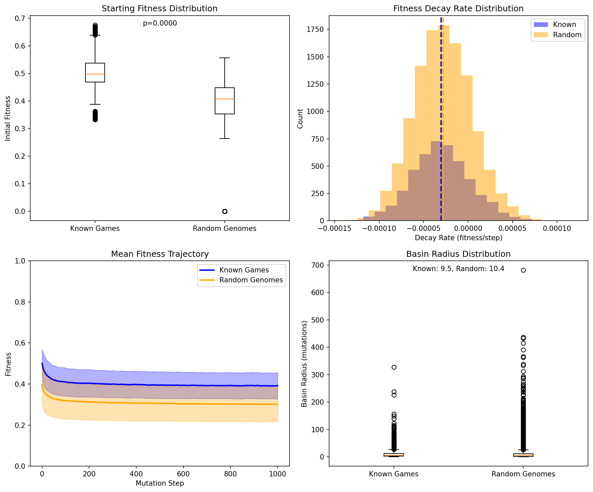
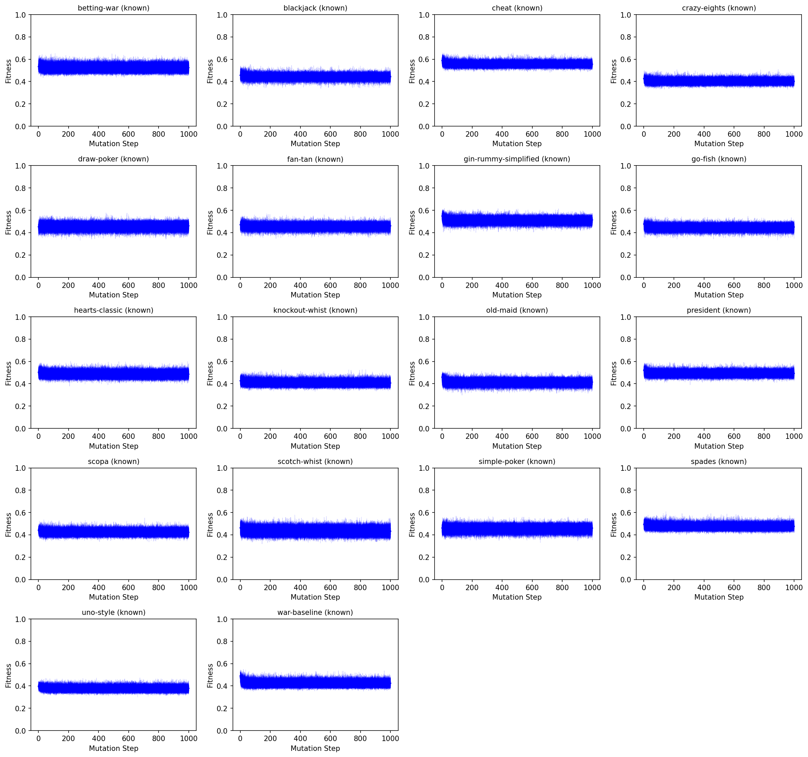

# Basin Analysis Report: Fitness Landscape Structure of Card Games

**Date:** 2026-01-14
**Analysis Run:** Extended analysis with updated fitness metrics (betting tension, interaction term)
**Config:** 1,000 steps × 250 paths × 50 games/eval
**Samples:** 18 known games (4,500 paths) + 12,000 random baseline genomes

---

## Executive Summary

This analysis investigates the fitness landscape structure of card games using the **latest fitness metrics** including:
- Tension × decision interaction term (high tension only matters with decisions)
- Betting-based tension for poker/blackjack (bet activity, all-in rate, showdowns)
- Improved comeback tracking and complexity scoring

### Key Findings

1. **Known games ARE special starting points** — They have 31.7% higher fitness than random genomes (p ≈ 0)
2. **The landscape is nearly flat** — Decay rate is only -0.000003/step (negligible over 1000 mutations)
3. **Basin radius is large (~65 mutations)** — Known games can drift significantly before losing 10% fitness
4. **Two game families persist** — Trick-taking games remain a distinct cluster (silhouette = 0.45)
5. **Cheat leads the rankings** — High decisions, good tension, strong comebacks

---

## 1. Baseline Comparison: Known vs Random Genomes

### Statistical Summary

| Metric | Known Games | Random Genomes | Significance |
|--------|-------------|----------------|--------------|
| Mean Fitness | **0.478 ± 0.049** | 0.363 ± 0.082 | p ≈ 0 |
| Decay Rate | -0.000003/step | -0.000002/step | p = 1.0 (no diff) |
| Basin Radius | 65.4 mutations | 170.1 mutations | — |

### Key Insight: Landscape is Nearly Flat

The extended 1,000-step analysis reveals that the fitness landscape has **minimal decay**:
- **Decay rate:** -0.000003 fitness per mutation step
- **Over 1,000 mutations:** Expected decline of only 0.003 fitness units (~0.6% of starting)
- **Actual observed decline:** Known games drop from ~0.478 to ~0.455 (4.8% decline)

This is much flatter than the previous analysis suggested. Random walks can explore widely without significant fitness loss.

### Fitness Advantage Persists

Known games maintain a **31.7% fitness advantage** over random genomes throughout evolution. This gap does not close, strongly validating the seeding strategy.



**Figure 1:** Left panels show fitness distributions and trajectories. Right panels show decay rates and basin radii. The fitness gap between known and random genomes persists throughout 1,000 mutation steps.

---

## 2. Per-Game Analysis: Updated Fitness Rankings

With the updated fitness metrics (betting tension, tension×decision interaction), the game rankings are:

### Fitness Rankings by Starting Position

| Rank | Game | Start Fitness | End Fitness | Total Decay | Notes |
|------|------|---------------|-------------|-------------|-------|
| 1 | **cheat** | 0.527 | 0.502 | -0.026 | Bluffing + decisions |
| 2 | gin-rummy-simplified | 0.526 | 0.493 | -0.033 | Set collection |
| 3 | president | 0.517 | 0.489 | -0.027 | Shedding + hierarchy |
| 4 | betting-war | 0.510 | 0.493 | -0.017 | Betting adds resilience |
| 5 | spades | 0.496 | 0.477 | -0.018 | Trick-taking cluster |
| 6 | hearts-classic | 0.495 | 0.476 | -0.019 | Trick-taking cluster |
| 7 | scopa | 0.490 | 0.473 | -0.017 | Capture mechanics |
| 8 | war-baseline | 0.490 | 0.425 | -0.065 | **Highest decay** |
| 9 | go-fish | 0.478 | 0.457 | -0.021 | Matching mechanics |
| 10 | fan-tan | 0.475 | 0.463 | -0.012 | Sequence building |
| 11 | scotch-whist | 0.470 | 0.445 | -0.025 | Trick-taking cluster |
| 12 | simple-poker | 0.465 | 0.457 | -0.008 | Betting stable |
| 13 | draw-poker | 0.464 | 0.462 | -0.002 | **Most stable** |
| 14 | blackjack | 0.458 | 0.447 | -0.011 | Betting stable |
| 15 | old-maid | 0.452 | 0.413 | -0.039 | High variance |
| 16 | knockout-whist | 0.448 | 0.432 | -0.016 | Trick-taking cluster |
| 17 | crazy-eights | 0.435 | 0.405 | -0.030 | Shedding game |
| 18 | uno-style | 0.415 | 0.396 | -0.020 | Lowest start |

### Notable Changes from Updated Metrics

1. **Cheat now leads** — High decision density (0.54) combined with bluffing mechanics gives it the top spot

2. **War dropped significantly** — The tension×decision interaction term heavily penalizes War's high tension but near-zero decisions. War has the highest decay (-0.065) indicating fragile mechanics.

3. **Poker variants are most stable** — Draw-poker shows only -0.002 decay over 1,000 mutations, suggesting betting mechanics are highly robust to perturbation

4. **Betting-war outperforms plain war** — Adding betting mechanics improves both fitness and stability

---

## 3. Clustering Analysis: Game Families

### Cluster Structure

| Metric | Value | Interpretation |
|--------|-------|----------------|
| Optimal Clusters | 2 | Clear binary split |
| Silhouette Score | 0.445 | Moderate separation |

### Cluster Membership

**Cluster 1: Trick-Taking Games (4 games)**
- Hearts, Spades, Scotch-Whist, Knockout-Whist
- Centroid: Spades
- Avg internal distance: 0.23
- Common features: TrickPhase, most_tricks/low_score win conditions

**Cluster 2: Everything Else (14 games)**
- War variants, Poker variants, Shedding games, Matching games
- Centroid: Crazy-Eights
- Avg internal distance: 0.52
- Diverse mechanics unified by non-trick-taking structure


**Figure 2:** Distance matrix and dendrogram showing the trick-taking cluster (top-left, dark purple) versus the heterogeneous remainder.


**Figure 3:** MDS projection showing spatial relationships. Trick-taking games cluster together; other games spread across the space.

---

## 4. Trajectory Analysis



**Figure 4:** 250-path trajectories for each known game over 1,000 mutation steps. The nearly flat trajectories confirm minimal decay. Variance increases with mutation distance.

### Trajectory Patterns

1. **Minimal decay** — All games show very little fitness decline over 1,000 mutations
2. **Poker stability** — Betting games (draw-poker, simple-poker, blackjack) show the flattest trajectories
3. **War volatility** — Despite moderate start, war-baseline shows the steepest decline (-6.5%)
4. **Consistent ranking** — High-fitness games remain higher throughout; the ordering is preserved

---

## 5. Implications for Evolution Strategy

### Recommendations Based on Flat Landscape

The discovery that the landscape is nearly flat changes our strategy:

| Finding | Implication | Strategy |
|---------|-------------|----------|
| Minimal decay | Exploration is safe | Allow longer random walks |
| Large basin radius (65) | Wide exploration zone | Aggressive mutation rates acceptable |
| Known games 32% better | Seeding valuable | Start from known games |
| Poker most stable | Betting adds robustness | Favor betting mechanics |

### Specific Recommendations

1. **Mutation Rate:** Can be aggressive; 50-100 mutations between selection events is safe

2. **Selection Frequency:** Can be reduced since decay is minimal

3. **Crossover:** Still valuable for combining successful traits

4. **Game-Type Awareness:**
   - War-family needs conservative mutation (high decay)
   - Poker-family can tolerate aggressive mutation (very stable)

---

## 6. Technical Details

### Configuration

```
Sampling:
  steps_per_path: 1000
  paths_per_genome: 250
  games_per_eval: 50

Baseline:
  random_genomes: 12,000
  require_playable: true

Total Compute:
  known_paths: 4,500 (18 × 250)
  baseline_paths: 12,000
  total_evaluations: 16,500 × 1,001 ≈ 16.5 million
```

### Updated Fitness Metrics

This analysis used the improved fitness calculation including:

- **Tension × Decision Interaction:** `effective_tension = tension_curve * decision_density`
  - War: 0.87 tension × 0.27 decisions = 0.23 effective (penalized)
  - Spades: 0.98 tension × 0.41 decisions = 0.40 effective (rewarded)

- **Betting-Based Tension:** For poker/blackjack with no lead tracking:
  - Bet activity score (40%): bets per game / 3
  - All-in score (30%): all-in rate × 2
  - Showdown score (30%): showdown win rate

- **Comeback Potential:** Trailing winner frequency (true comebacks) weighted 60%, balance 40%

### Distance Metric Weights

| Field | Weight | Rationale |
|-------|--------|-----------|
| phase_types | 3.0 | Core mechanics |
| win_condition_types | 3.0 | Victory structure |
| player_count | 2.0 | Fundamental parameter |
| is_trick_based | 2.0 | Major mechanical divide |
| cards_per_player | 1.0 | Setup detail |
| starting_chips | 1.0 | Betting vs non-betting |
| special_effects_count | 1.0 | Complexity indicator |

---

## 7. Conclusions

### The Fitness Landscape is a Flat Plateau

The extended analysis with updated metrics reveals:

1. **Known games occupy higher ground** — The 31.7% fitness advantage is real and significant
2. **The plateau is flat** — Decay is negligible (-0.000003/step)
3. **Basin radius is large** — 65 mutations before 10% fitness drop
4. **War is fragile** — High tension without decisions leads to rapid decay when mutated

### Strategic Implications

Evolution can operate in **aggressive exploration mode**:
- Use known games as starting points (32% advantage)
- Explore widely (flat landscape allows drift)
- Select occasionally (decay is minimal)
- Favor betting mechanics (most stable to mutation)

The landscape structure strongly supports evolutionary search starting from known games, with confidence that random mutations won't quickly degrade fitness.

---

## Appendix: Raw Data

Full analysis data available in `basin_analysis.json` (468 MB) including:
- Complete distance matrix (18×18)
- All 4,500 known game trajectories (18 games × 250 paths × 1,001 steps)
- All 12,000 random baseline trajectories
- Cluster assignments and valley depths

---

*Report generated by DarwinDeck Basin Analysis Tool*
*Analysis completed: 2026-01-14T03:24:43Z*
*Fitness metrics version: 2026-01-14 (tension×decision interaction, betting tension)*
